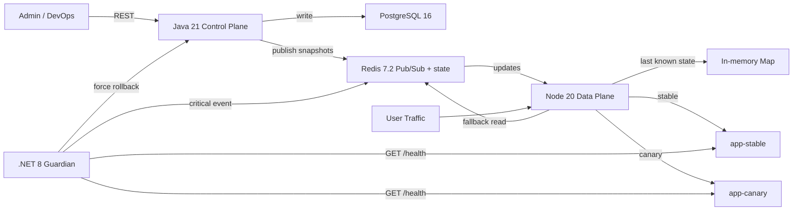

# Feature Flags and Canary Deployment Engine


Senior portfolio project demonstrating decoupling between deployment and release, contextual targeting at the edge, and telemetry‑driven autonomous auto‑rollback. The current version elevates a technical demo into a product experience with a premium operational dashboard, consistent error contracts, administrative hardening, and test coverage over sensitive flows.

---

## What Changed in This Premium Version

- Operational dashboard served by the control plane at `http://localhost:8081`, providing a unified view of flags, data plane, guardian, stable, and canary.
- Administrative APIs protected by `X-Admin-Token` without breaking the local flow when the token is empty.
- Control plane with Flyway, stronger validations, professional error contracts, and read/list endpoints.
- Modularised data plane with real readiness, edge decision preview, request IDs, and protected internal endpoints.
- Guardian with configuration validation, enriched telemetry, probe history, and rollback resilient to external failures.
- Tests covering rule evaluation in Java, edge decision in Node, and telemetry state in .NET.

---

## Why Flag Evaluation Happens in Node.js, Not Java

Java is the control plane: it persists, validates, and propagates changes.  
Node.js is the data plane: it receives live traffic and must respond in microseconds without depending on a database or adding a round‑trip per request. Evaluating the flag at the edge reduces latency, avoids pressure on PostgreSQL, and keeps the decision plane close to the network packet. Java publishes snapshots to Redis; Node subscribes to Pub/Sub, maintains an in‑memory `Map`, and continues routing even if Redis fluctuates by using the last known state.

---

## Why Auto‑Rollback Lives in .NET, Not Java or Node

Auto‑rollback is a reliability concern and must be isolated from the delivery domain. If the data plane or control plane degrades, the guardian cannot fail along with them. The .NET worker operates as an independent third observer: it measures `/health`, accumulates consecutive failures, triggers rollback in Java, and publishes the critical event to Redis. This isolation is intentional and mirrors how SRE systems treat protection mechanisms like organisational circuit breakers.

---

## Canary Release vs Feature Flag

A simple feature flag controls access to a functionality. A canary release controls progressive exposure of a new service version. Here both concepts meet: the flag `new-checkout` decides whether a request goes to `stable` or `canary`, and the guardian can automatically revert exposure when canary health degrades.

---

## System Architecture



All components are containerised. The data plane remains operational even during transient Redis failures by serving decisions from its in‑memory cache (last known snapshot).

---

## Project Structure

```text
.
├── java-control-plane/          # Core flag management (Java + Spring Boot)
├── node-data-plane/             # Edge routing & targeting (Node.js + Express)
├── dotnet-guardian/             # Autonomous health watcher (.NET 8)
├── dotnet-guardian.tests/       # Unit tests for the guardian
├── app-stable/                  # Stable version of the dummy checkout service
├── app-canary/                  # Canary version of the dummy checkout service
├── docker-compose.yml
└── README.md
```

---

## Targeting Rules

All rules for the same `targetVersion` are evaluated together with `AND`. The seed creates the flag `new-checkout` with three `CANARY` rules:

1. `country == BR`
2. `platform == iOS`
3. `userId % 100 < 10`

This means only Brazilian iOS users falling into the percentage bucket will be routed to the canary version.

---

## Environment Variables

Create a `.env` file from `.env.example` with the following variables:

```bash
# PostgreSQL
POSTGRES_DB=featureflags
POSTGRES_USER=admin
POSTGRES_PASSWORD=changeme

# Redis
REDIS_URL=redis://redis:6379

# Optional: administrative security token (empty = open mode)
ADMIN_API_TOKEN=

# Service ports (optional, defaults work)
JAVA_CONTROL_PLANE_PORT=8081
NODE_DATA_PLANE_PORT=8080
DOTNET_GUARDIAN_PORT=8083
APP_STABLE_PORT=8084
APP_CANARY_PORT=8085
```

If `ADMIN_API_TOKEN` is set, all administrative endpoints require the `X-Admin-Token` header. When empty, the environment runs in open mode for easy local demonstration.

---

## Quick Demo (3 steps)

1. **Start the environment**
   ```bash
   docker compose up --build
   ```

2. **Open the operational dashboard**
   ```
   http://localhost:8081
   ```

3. **Send a request that matches the canary bucket**
   ```bash
   curl http://localhost:8080/api/checkout \
     -H "X-User-Context: userId=7,country=BR,platform=iOS"
   ```

   Expected response (canary):
   ```json
   { "version": "canary", "checkout": "new amazing flow" }
   ```

For a complete walkthrough, see the **Step‑by‑Step Testing Guide** below.

---

## Step‑by‑Step Testing Guide

### 0. Open the Premium Console

Access `http://localhost:8081` and observe:
- Status of control plane, data plane, guardian, stable, and canary
- Flags catalogue, rules, and global release state
- Edge routing preview lab
- Guardian rollback history

### 1. Create a New Flag via the Java Admin API

```bash
curl -X POST http://localhost:8081/api/admin/flags \
  -H "Content-Type: application/json" \
  -H "X-Admin-Token: $ADMIN_API_TOKEN" \
  -d '{"key":"holiday-pricing","description":"Seasonal pricing experiment","enabled":false,"environmentName":"production"}'
```

In open mode, the `X-Admin-Token` header may be omitted.

### 2. Enable the Seeded Flag `new-checkout` to Release the 10% Canary

The environment starts with the seeded flag disabled to highlight the decoupling between deploy and release.

Seeded flag ID: `11111111-1111-1111-1111-111111111111`

```bash
curl -X PUT http://localhost:8081/api/admin/flags/11111111-1111-1111-1111-111111111111/toggle \
  -H "Content-Type: application/json" \
  -H "X-Admin-Token: $ADMIN_API_TOKEN" \
  -d '{"enabled":true,"reason":"release 10% BR iOS canary"}'
```

### 3. Prove Dynamic Routing Using the `X-User-Context` Header

Brazilian iOS user inside the percentage bucket → canary:

```bash
curl http://localhost:8080/api/checkout \
  -H "X-User-Context: userId=7,country=BR,platform=iOS"
```

Outside the percentage bucket → stable:

```bash
curl http://localhost:8080/api/checkout \
  -H "X-User-Context: userId=15,country=BR,platform=iOS"
```

Different country → stable:

```bash
curl http://localhost:8080/api/checkout \
  -H "X-User-Context: userId=7,country=US,platform=iOS"
```

Different platform → stable:

```bash
curl http://localhost:8080/api/checkout \
  -H "X-User-Context: userId=7,country=BR,platform=Android"
```

To observe the routing decision in real time:

```bash
docker compose logs -f node-data-plane app-stable app-canary
```

### 4. Simulate Canary Failure

```bash
curl -X POST http://localhost:8085/admin/fail-health \
  -H "X-Admin-Token: $ADMIN_API_TOKEN"
```

Follow the guardian logs:

```bash
docker compose logs -f dotnet-guardian
```

After three consecutive `500` health checks, the worker will:

1. Call `PUT /api/admin/flags/{id}/toggle` on Java with `enabled=false`
2. Publish `feature-flags:rollback` to Redis
3. Record the rollback in the telemetry API history

### 5. Prove Auto‑Rollback

Repeat the request that previously went to canary:

```bash
curl http://localhost:8080/api/checkout \
  -H "X-User-Context: userId=7,country=BR,platform=iOS"
```

Even for the bucket that used to hit canary, the response now becomes `stable` because the guardian has disabled the flag globally.

### 6. Query Guardian Status

```bash
curl http://localhost:8083/api/telemetry/status
```

Example output:

```json
{
  "flagKey": "new-checkout",
  "current": {
    "stable": { "statusCode": 200 },
    "canary": { "statusCode": 500 },
    "consecutiveCanaryFailures": 3,
    "rollbackHistory": [{ "action": "FORCED_STABLE_ROUTING" }]
  }
}
```

### 7. Recover the Canary for Further Tests

```bash
curl -X POST http://localhost:8085/admin/recover-health \
  -H "X-Admin-Token: $ADMIN_API_TOKEN"
```

To re‑enable canary exposure, simply toggle the flag back on:

```bash
curl -X PUT http://localhost:8081/api/admin/flags/11111111-1111-1111-1111-111111111111/toggle \
  -H "Content-Type: application/json" \
  -H "X-Admin-Token: $ADMIN_API_TOKEN" \
  -d '{"enabled":true,"reason":"retry after canary recovery"}'
```

---

## Main Endpoints

**Control Plane (Java)**
- `GET  /` – operational dashboard
- `GET  /api/admin/flags`
- `GET  /api/admin/flags/{id}`
- `POST /api/admin/flags`
- `PUT  /api/admin/flags/{id}/toggle`
- `POST /api/admin/flags/{id}/rules`
- `GET  /api/platform/overview`
- `POST /api/platform/decision-preview`

**Data Plane (Node.js)**
- `GET /health`
- `GET /ready`
- `GET /internal/flags`
- `POST /internal/decision-preview`

**Guardian (.NET)**
- `GET /health`
- `GET /ready`
- `GET /api/telemetry/status`

---

## Running the Environment

```bash
docker compose up --build
```

Published ports:

| Service               | Port |
|-----------------------|------|
| Node data plane       | 8080 |
| Java control plane    | 8081 |
| .NET guardian         | 8083 |
| app-stable            | 8084 |
| app-canary            | 8085 |
| PostgreSQL            | 5432 |
| Redis                 | 6379 |

Operational dashboard: [http://localhost:8081](http://localhost:8081)

---

## Local Quality Checks

**Java (control plane)**
```bash
cd java-control-plane
mvn test
```

**Node.js (data plane)**
```bash
cd node-data-plane
npm test
```

**.NET (guardian)**
```bash
dotnet test dotnet-guardian.tests/dotnet-guardian.tests.csproj
```

---

## Operational Notes

- PostgreSQL uses a named volume `postgres-data` to persist the flag catalogue across restarts.
- The control plane schema is managed by Flyway; Hibernate runs in `validate` mode.
- The dashboard never requires the browser to talk directly to Node or .NET; Java aggregates the operational view and keeps the console same‑origin.
- The data plane continues to obey the original restriction: in‑memory decision with Redis Pub/Sub, no polling to the database.
- When Redis is unavailable, the data plane serves decisions from its last known snapshot (cache) and logs the fallback event.

---

## Current Limitations

The Feature Flags and Canary Deployment Engine is a **portfolio‑grade demonstration** and is not intended for production use without further development. Known limitations include:

- **Authentication/authorisation** – Only a simple admin token is supported. No OAuth2, SSO, or role‑based access control (RBAC).
- **CI/CD pipeline** – No automated build, test, and deployment pipeline (e.g., GitHub Actions, GitLab CI).
- **Observability** – No centralised logging, metrics collection (Prometheus), or distributed tracing (OpenTelemetry).
- **Scalability** – The data plane does not support horizontal scaling out of the box (no shared‑nothing configuration or sticky sessions).
- **Persistent storage for telemetry** – The guardian’s rollback history is kept in memory; a production system would require persistent audit logs.
- **OpenAPI documentation** – No machine‑readable API specification is provided.

---

## Future Enhancements

The following improvements are planned for subsequent iterations:

- **CI/CD pipeline** (GitHub Actions) with automated tests, linting, and Docker image publishing.
- **OAuth2 / OpenID Connect** integration (e.g., Auth0, Keycloak) for fine‑grained access control.
- **Observability stack** – Prometheus metrics, Grafana dashboards, Loki logs, and Tempo traces.
- **Horizontal scaling** for the data plane using a shared Redis state or consistent hashing.
- **Dead Letter Queue (DLQ)** for failed audit events.
- **OpenAPI / Swagger** specifications for all public APIs.
- **Kubernetes deployment** manifests (Helm charts) for cloud‑native orchestration.
- **End‑to‑end integration tests** using Testcontainers.

---

## License

MIT License. See [LICENSE](LICENSE) file for details.

---

## Purpose

This project was developed to demonstrate:

- Decoupling between deployment and release using feature flags and canary releases.
- Low‑latency, edge‑based contextual targeting without database round‑trips.
- Autonomous, telemetry‑driven rollback isolated from the delivery domain.
- Polyglot microservices architecture with clear separation of concerns.
- Production‑grade patterns (idempotency, health checks, fallback caching, operational dashboards).
