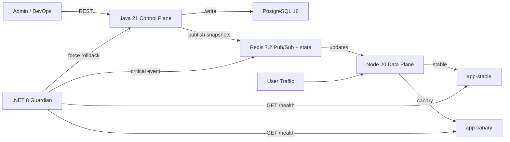

# Feature Flags and Canary Deployment Engine

Projeto de portfólio Sênior para demonstrar desacoplamento entre deploy e release, targeting contextual na borda e auto-rollback autônomo orientado por telemetria. A versão atual foi elevada de demo técnica para uma experiência de produto com dashboard operacional premium, contratos de erro consistentes, hardening administrativo e cobertura de testes sobre os fluxos sensíveis.

## O que mudou nesta versão premium

- Dashboard operacional servido pelo control plane em `http://localhost:8081`, com visão unificada de flags, data plane, guardian, stable e canary.
- APIs administrativas protegíveis por `X-Admin-Token` sem quebrar o fluxo local quando o token estiver em branco.
- Control plane com Flyway, validações mais fortes, contratos de erro profissionais e endpoints de leitura/listagem.
- Data plane modularizado, com readiness real, prévia de decisão na borda, request ids e endpoints internos protegidos.
- Guardian com validação de configuração, telemetria enriquecida, histórico de probes e rollback resiliente a falhas externas.
- Testes cobrindo avaliação de regras no Java, edge decision no Node e estado de telemetria no .NET.

## Por que a avaliação da flag acontece no Node.js e não no Java?

O Java é o control plane: ele persiste, valida e propaga mudanças. O Node.js é o data plane: ele recebe o tráfego real e precisa responder em microssegundos, sem depender de banco e sem adicionar round-trip para cada request. Avaliar a flag na borda reduz latência, evita pressão no PostgreSQL e mantém o plano de decisão perto do pacote de rede. O Java publica snapshots no Redis; o Node assina Pub/Sub, mantém um `Map` em memória e continua roteando mesmo se o Redis oscilar, usando o último estado conhecido.

## Por que o auto-rollback está em .NET e não no Java ou no Node?

Rollback automático é um domínio de confiabilidade e precisa ficar isolado do domínio de entrega. Se o data plane ou o control plane estiverem degradados, o guardião não pode cair junto. O worker .NET opera como terceiro observador independente: mede `/health`, acumula falhas consecutivas, aciona rollback no Java e publica o evento crítico no Redis. Esse isolamento é intencional e espelha a forma como sistemas de SRE tratam mecanismos de proteção como circuit breakers organizacionais.

## Canary Release vs Feature Flag Simples

Uma feature flag simples controla acesso a uma funcionalidade. Um canary release controla exposição progressiva de uma nova versão do serviço. Aqui os dois conceitos se encontram: a flag `new-checkout` decide se o request vai para `stable` ou `canary`, e o guardian pode reverter a exposição automaticamente quando a saúde do canário degrada.

## Arquitetura



## Estrutura

```text
.
├── java-control-plane/
├── node-data-plane/
├── dotnet-guardian/
├── dotnet-guardian.tests/
├── app-stable/
├── app-canary/
├── docker-compose.yml
└── README.md
```

## Regras de targeting

Todas as regras de um mesmo `targetVersion` são avaliadas em conjunto com `AND`. A seed inicial cria a flag `new-checkout` com três regras `CANARY`:

1. `country == BR`
2. `platform == iOS`
3. `userId % 100 < 10`

Isso significa que apenas usuários brasileiros de iOS que caiam no bucket percentual irão para a versão canário.

## Subida do ambiente

```bash
docker compose up --build
```

Dashboard operacional:

```text
http://localhost:8081
```

Portas publicadas:

- `8080`: Node data plane
- `8081`: Java control plane
- `8083`: .NET guardian
- `8084`: app-stable
- `8085`: app-canary
- `5432`: PostgreSQL
- `6379`: Redis

## Segurança administrativa opcional

Se quiser rodar o projeto em modo protegido, copie `.env.example` para `.env` e configure:

```bash
ADMIN_API_TOKEN=change-me-in-demo
```

Quando esse valor estiver presente:

- o dashboard pedirá o token antes de liberar operações;
- `/api/admin/*` e `/api/platform/*` no Java exigirão `X-Admin-Token`;
- os endpoints internos do data plane e os endpoints de simulação dos apps dummy também exigirão o token;
- o guardian enviará automaticamente esse header ao acionar rollback no control plane.

Se o valor estiver vazio, o ambiente continua funcionando em modo aberto para facilitar demonstração local.

## Guia de teste passo a passo

### 0. Abrir o console premium

Acesse `http://localhost:8081` e acompanhe:

- status do control plane, data plane, guardian, stable e canary;
- catálogo de flags, regras e estado global de release;
- laboratório de preview de roteamento na borda;
- histórico de rollback do guardian.

### 1. Criar uma nova flag via Admin API Java

```bash
curl -X POST http://localhost:8081/api/admin/flags \
  -H "Content-Type: application/json" \
  -H "X-Admin-Token: $ADMIN_API_TOKEN" \
  -d '{"key":"holiday-pricing","description":"Seasonal pricing experiment","enabled":false,"environmentName":"production"}'
```

Se você estiver em modo aberto, o header `X-Admin-Token` pode ser omitido.

### 2. Ativar a flag seeded `new-checkout` para liberar o canário de 10%

O ambiente sobe com a flag seeded desabilitada para evidenciar o desacoplamento entre deploy e release.

ID da flag seeded: `11111111-1111-1111-1111-111111111111`

```bash
curl -X PUT http://localhost:8081/api/admin/flags/11111111-1111-1111-1111-111111111111/toggle \
  -H "Content-Type: application/json" \
  -H "X-Admin-Token: $ADMIN_API_TOKEN" \
  -d '{"enabled":true,"reason":"release 10% BR iOS canary"}'
```

### 3. Provar o roteamento dinâmico pelo header `X-User-Context`

Usuário brasileiro, iOS e bucket percentual abaixo de 10 vai para o canário:

```bash
curl http://localhost:8080/api/checkout \
  -H "X-User-Context: userId=7,country=BR,platform=iOS"
```

Resposta esperada:

```json
{
  "version": "canary",
  "checkout": "new amazing flow"
}
```

Mesmo contexto, mas fora do bucket percentual, continua no estável:

```bash
curl http://localhost:8080/api/checkout \
  -H "X-User-Context: userId=15,country=BR,platform=iOS"
```

Resposta esperada:

```json
{
  "version": "stable",
  "checkout": "old flow"
}
```

Bucket válido, mas país diferente, continua no estável:

```bash
curl http://localhost:8080/api/checkout \
  -H "X-User-Context: userId=7,country=US,platform=iOS"
```

Bucket válido, mas plataforma diferente, continua no estável:

```bash
curl http://localhost:8080/api/checkout \
  -H "X-User-Context: userId=7,country=BR,platform=Android"
```

Para observar o caminho tomado:

```bash
docker compose logs -f node-data-plane app-stable app-canary
```

### 4. Simular falha no canário

```bash
curl -X POST http://localhost:8085/admin/fail-health \
  -H "X-Admin-Token: $ADMIN_API_TOKEN"
```

Agora acompanhe o guardião:

```bash
docker compose logs -f dotnet-guardian
```

Após três verificações consecutivas com `500`, o worker faz:

1. `PUT /api/admin/flags/{id}/toggle` no Java com `enabled=false`
2. `PUBLISH feature-flags:rollback` no Redis
3. Registro do rollback no histórico exposto pela API de telemetria

### 5. Provar o auto-rollback

Repita o request que antes caía no canário:

```bash
curl http://localhost:8080/api/checkout \
  -H "X-User-Context: userId=7,country=BR,platform=iOS"
```

Mesmo para o bucket que antes ia para canário, a resposta passa a ser `stable` porque o guardian desligou a flag globalmente.

### 6. Consultar estado do guardião

```bash
curl http://localhost:8083/api/telemetry/status
```

Exemplo de retorno:

```json
{
  "flagKey": "new-checkout",
  "current": {
    "stable": {
      "statusCode": 200
    },
    "canary": {
      "statusCode": 500
    },
    "consecutiveCanaryFailures": 3,
    "rollbackHistory": [
      {
        "action": "FORCED_STABLE_ROUTING"
      }
    ]
  }
}
```

### 7. Recuperar o canário para novos testes

```bash
curl -X POST http://localhost:8085/admin/recover-health \
  -H "X-Admin-Token: $ADMIN_API_TOKEN"
```

Se quiser reabrir a exposição, basta reativar a flag:

```bash
curl -X PUT http://localhost:8081/api/admin/flags/11111111-1111-1111-1111-111111111111/toggle \
  -H "Content-Type: application/json" \
  -H "X-Admin-Token: $ADMIN_API_TOKEN" \
  -d '{"enabled":true,"reason":"retry after canary recovery"}'
```

## Endpoints principais

Control plane:

- `GET /` dashboard operacional premium
- `GET /api/admin/flags`
- `GET /api/admin/flags/{id}`
- `POST /api/admin/flags`
- `PUT /api/admin/flags/{id}/toggle`
- `POST /api/admin/flags/{id}/rules`
- `GET /api/platform/overview`
- `POST /api/platform/decision-preview`

Data plane:

- `GET /health`
- `GET /ready`
- `GET /internal/flags`
- `POST /internal/decision-preview`

Guardian:

- `GET /health`
- `GET /ready`
- `GET /api/telemetry/status`

## Qualidade local

Java:

```bash
mvn test
```

Node data plane:

```bash
npm test
```

.NET guardian:

```bash
dotnet test dotnet-guardian.tests/dotnet-guardian.tests.csproj
```

## Notas operacionais

- O PostgreSQL agora usa volume nomeado `postgres-data` para persistir o catálogo entre reinícios.
- O schema do control plane é criado por Flyway e o Hibernate roda em modo `validate`.
- O dashboard nunca depende do browser falar diretamente com Node ou .NET; o Java agrega a visão operacional e mantém o console same-origin.
- O data plane continua obedecendo a restrição original: decisão em memória com Redis Pub/Sub, sem polling em banco.
